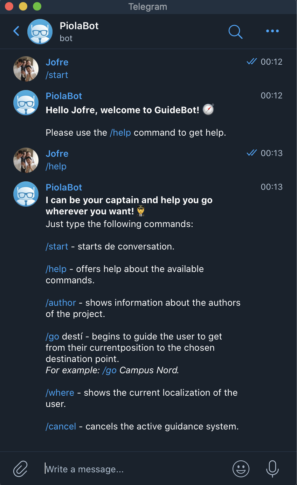
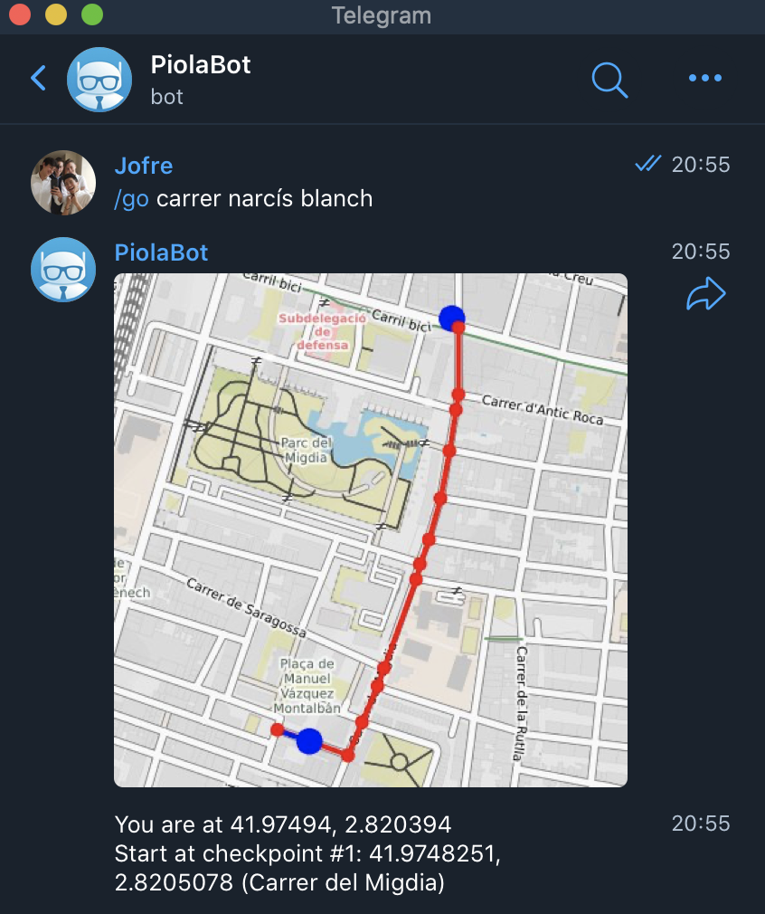
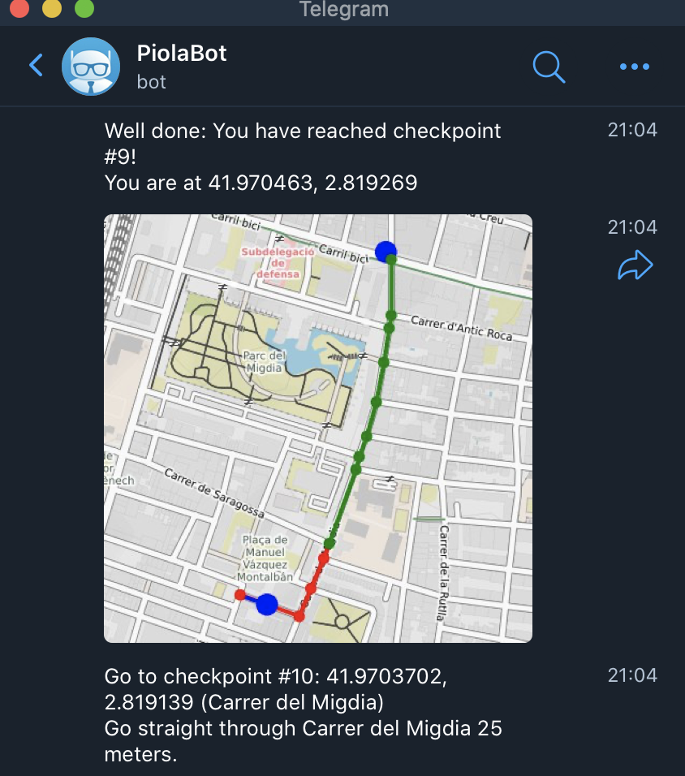
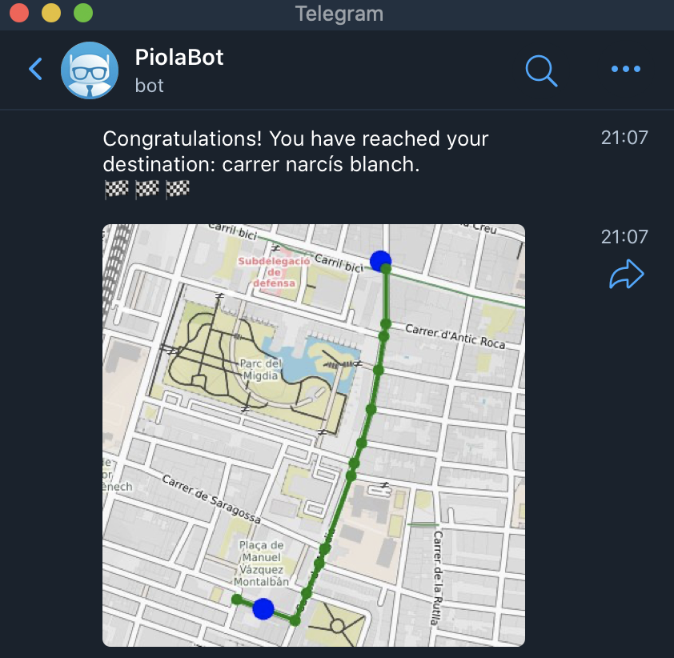
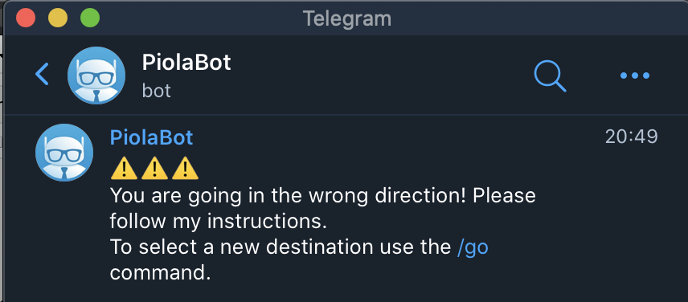
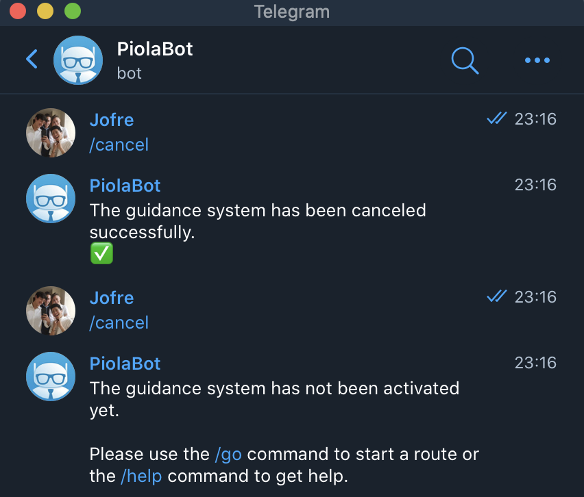
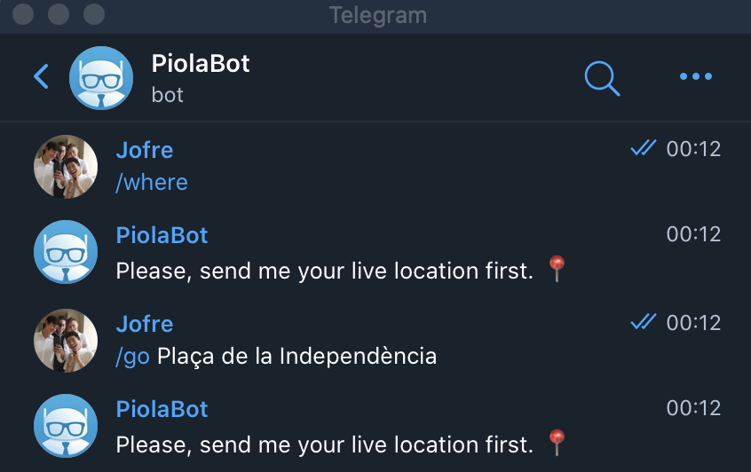
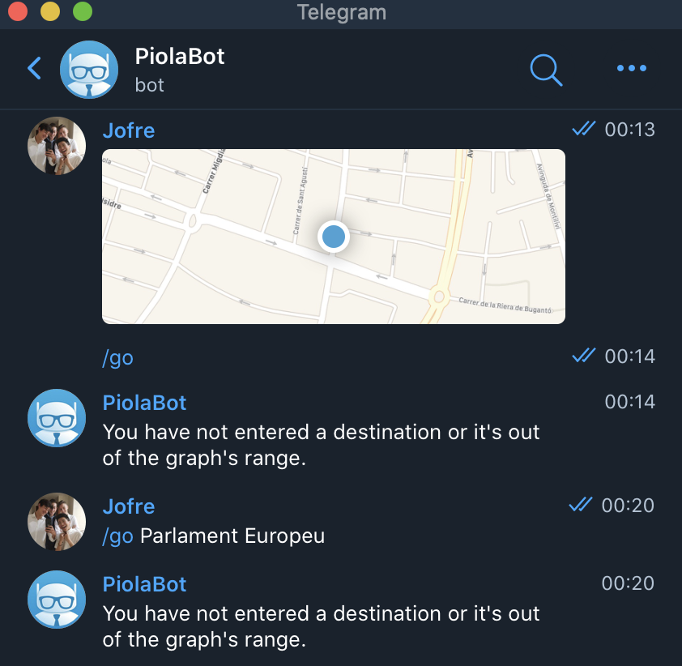
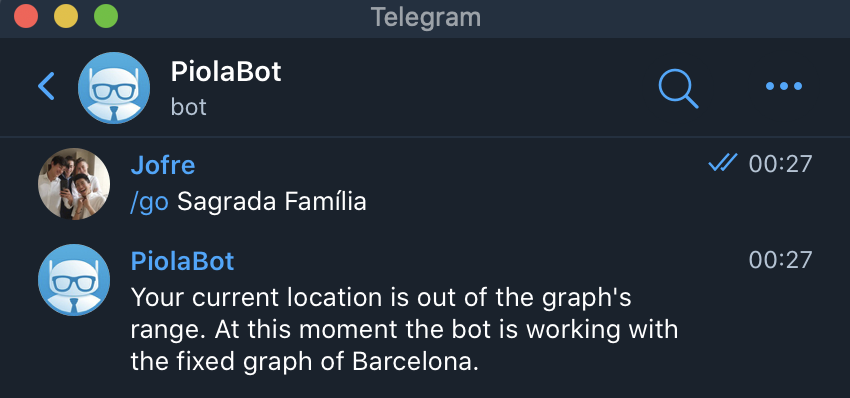
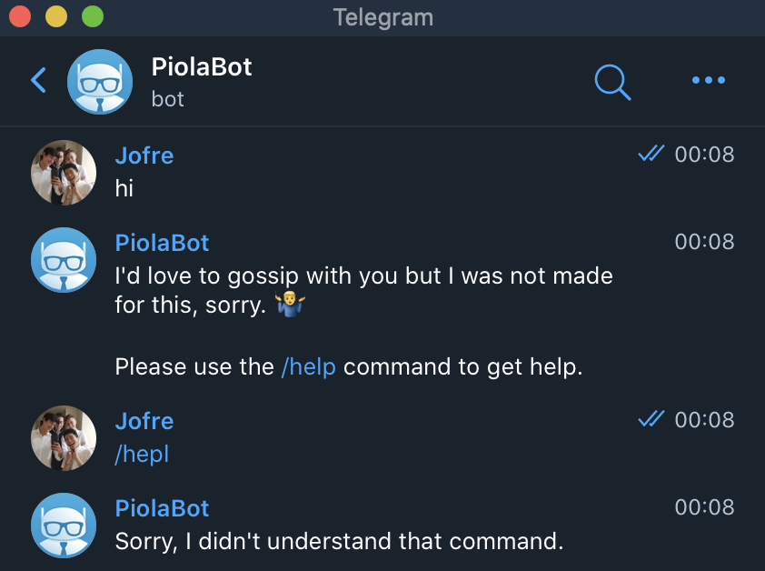

# GuideBot by Team Piola

**I can be your captain and help you go wherever you want! 🧭**

## Introduction

**Guidebot** is a Python project that using a Telegram Bot, users can be guided from 
their location to a destination through a map obtained by [Open Street Map](https://www.openstreetmap.org). 

### Prerequisites

The Pyhton packages used are the following:

- `networkx` to manipulate graphs.
- `osmnx` to obtain graphs from places.
- `haversine` to calculate distances between coordinates.
- `staticmap` to paint maps.
- `python-telegram-bot` to use Telegram.

You can install them via `pip3 install` like in the following example:

```sh
$ pip3 install networkx
```

Nonetheless, `osmnx` also requires installing `spatialindex` 
(installable with` brew install spatialindex` on Mac or
`apt install libspatialindex-dev` on Ubuntu). They can all also be installed with
Anaconda.

All the necessary software to run the project is in the file `requirements.txt`.

It's also required to have downloaded the Telegram application, as it will be the platform to interact with the bot.


### System architecture

The system consists of two modules:

- `guide.py`, which is an independent module with the function of getting and saving graphs corresponding to maps and make the calculations of the shortest routes.
- `bot.py`, which contains all the code related to the Telegram bot. Its goal is to react to the user commands and live location in order to lead him to a specific destination within a fixed graph. The module `guide.py` is used to get information about the guidance.


## `guide` module

The `guide` module contains the following functions:

- `download_graph(place)`: Downloads an osmnx graph from a place.
- `save_graph(graph, filename)`: Saves the graph in a pickle format.
- `load_graph(filename)`: Loads a graph from a pickle file. The file must be in your system.
- `print_graph(graph)`: Prints every node and all its adjacent edges information
of a graph. It has debugging functionality.
- `get_directions(graph, source_location, destination_location)`: Gives a list with
information for the guidance of the shortest route from the source location to the destination location .
The two points are given through their coordinates (latitude, longitude). Every section of the route
has the following structure in the list:

```python

{'angle': 38.99600000000001, 'current_name': 'Carrer de Josep Aguilera i Martí', 'dst': (41.9636285, 2.8204915), 'length': 212.721, 'mid': (41.9646037, 2.8207882), 'next_name': 'Pujada de la Creu de Palau', 'src': (41.965998, 2.8198635)}

````
*This is an example of a section of a route in Girona, Spain.*


- `plot_directions(graph, source_location, destination_location, directions, filename, width=400, height=400)`:
Draws a route to go from the source location to the destination location in a graph 
on a map in PNG format using `staticmap`.


## `bot` module

This module enables the connection between the user and Telegram. The bot begins downloading (or loading) a chosen fixed graph and then waits for the user's interaction. The Telegram user has several commands at his disposal to obtain information about the bot and start a guided route to a chosen destination:

- `/start`: starts the conversation.
- `/help`: offers help about the available commands.
- `/author`: shows information about the authors of the project.
- `/go destination`: starts a guidance from the location of the user to the chosen destination.
- `/where`: shows the current location of the user.
- `/cancel`: cancels the active guidance of the user.

The bot works for various users at the same time, as there is a global dictionary which stores the essential data of every user.

Finally, the users must share they live location to the bot before activating the guidance system or using the where command. It's used to track down the user's current location during the whole route.


## Execution

To use the bot, it is needed an _access token_, which is an identifier provided by Telegram unique to identify every bot. To generate and implement one do the following steps:

- Visit the [@BotFather](https://telegram.me/botfather) bot on Telegram.
- Use the command `/newbot` and give the required information (full name and username of the bot).
- Save the generated _access token_ into a file called `token.txt` in the same folder that the module `bot`.

Finally, to make the bot operative, it just has to be executed in the same folder that the module `guide.py` and the file `token.txt`. Then, all the users of Telegram will be able to use the bot.

You must save the photo `author.JPG` in the same folder that the module `bot` to be available to see the picture of the authors.

## Examples
Below, there are some examples of the interaction between the user and the bot:

- The commands `/start`, `/help`, `/author`:

<center></center>

<center></center>


- The `/where` command shows the user its current location:

<center></center>


- The command `/go destination` begins the guidance of the user to the chosen destination. The bot keeps sending instructions as the user moves:

<center></center>

<center></center>

<center></center>

- If the user doesn't follow the route and gets lost, the bot sends a warning:

<center></center>

- If the user wants to cancel the route, he/she uses the command `/cancel`. However, if there isn't an active route, the bot sends a warning:

<center></center>

- If the user uses the command `/where` or `/go` before sending its location, the bot sends a warning:

<center></center>


- If the user types the command `/go` without a destination or it's out of the fixed graph's range (5 km), the bot sends a warning. In this case the user types _Parlament Europeu_ as a destination, which is in Brussels and the fixed graph is Girona:

<center></center>

- Furthermore, if the current location of the user it's outside the graph's range, another warning is sent. In this case the user types _Sagrada Família_ as a destination, but the fixed graph is Girona:

<center></center>

- Finally, if the user makes a mistake typing a command or the bot receives a casual message, a warning is sent:

<center></center>


## Authors

Marc Garcia and Jofre Poch

Universitat Politècnica de Catalunya, 2020

